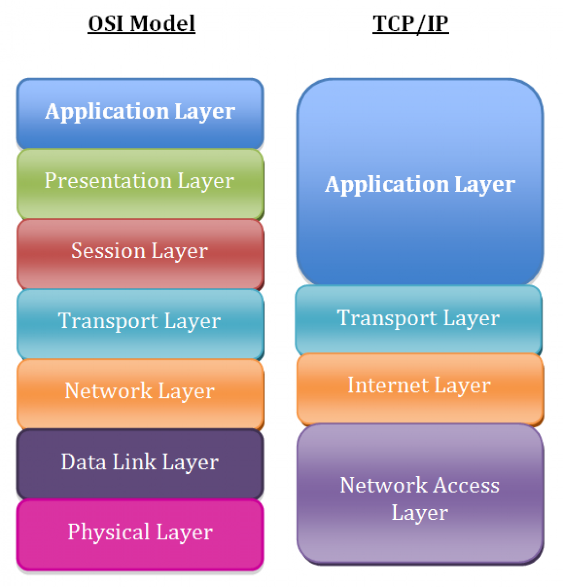

### A quick review of the TCP/IP model

First, let’s take a moment to review the fundamentals of the TCP/IP network model. While most people use the 
Open Systems Interconnection (OSI) model to discuss network theory, the TCP/IP model more accurately represents the 
suite of protocols that are deployed in modern networks.

The layers in the TCP/IP network model, in order, include:

* Layer 5: Application
* Layer 4: Transport
* Layer 3: Network/Internet
* Layer 2: Data Link
* Layer 1: Physical

> Where to start troubleshooting is situation-dependent. For example, if you can SSH to a server, but the server can’t 
> connect to a MySQL database, the problem is unlikely to be the physical or data link layers on the local server. 
> In general, it’s a good idea to work your way down the stack. Start with the application, and then gradually 
>troubleshoot each lower layer until you’ve isolated the problem.

With that background out of the way, let’s jump to the command line and start troubleshooting.

### Layer 1: The physical layer

We often take the physical layer for granted ("did you make sure the cable is plugged in?"), but we can easily 
troubleshoot physical layer problems from the Linux command line. That is if you have console connectivity to the host, 
which might not be the case for some remote systems.

###### 1. Is a device disabled?

Let’s start with the most basic question: Is our physical interface up? The ip link show command tells us:

    ip link show

    1: lo: <LOOPBACK,UP,LOWER_UP> mtu 65536 qdisc noqueue state UNKNOWN mode DEFAULT group default qlen 1000
    link/loopback 00:00:00:00:00:00 brd 00:00:00:00:00:00
    2: eth0: <BROADCAST,MULTICAST> mtu 1500 qdisc pfifo_fast state DOWN mode DEFAULT group default qlen 1000
    link/ether 52:54:00:82:d6:6e brd ff:ff:ff:ff:ff:ff

Notice the indication of DOWN in the above output for the eth0 interface. This result means that Layer 1 isn’t coming 
up. We might try troubleshooting by checking the cabling or the remote end of the connection (e.g., the switch) for 
problems.

###### Display all network interfaces and IP address
`ip a`

###### Display eth0 address and details
`ip addr show dev eth0`

###### Query or control network driver and hardware settings
`ethtool eth0`

###### 2. Set up a disabled device back. 

Before you start checking cables, though, it’s a good idea to make sure that the interface isn’t just disabled. 
Issuing a command to bring the interface up can rule this problem out:

    ip link set eth0 up

The output of ip link show can be difficult to parse at a quick glance. Luckily, the -br switch prints this output in a 
much more readable table format:

    ip -br link show

    lo UNKNOWN 00:00:00:00:00:00 <LOOPBACK,UP,LOWER_UP>
    eth0 UP 52:54:00:82:d6:6e <BROADCAST,MULTICAST,UP,LOWER_UP>

It looks like ip link set eth0 up did the trick, and eth0 is back in business.

### Layer 2: The data link layer

The data link layer is responsible for local network connectivity; essentially, the communication of frames between 
hosts on the same Layer 2 domain (commonly called a local area network). The most relevant Layer 2 protocol for most 
sysadmins is the Address Resolution Protocol (ARP), which maps Layer 3 IP addresses to Layer 2 Ethernet MAC addresses. 
When a host tries to contact another host on its local network (such as the default gateway), it likely has the other 
host’s IP address, but it doesn’t know the other host’s MAC address. ARP solves this issue and figures out the MAC 
address for us.

A common problem you might encounter is an ARP entry that won’t populate, particularly for your host’s default gateway. 
If your localhost can’t successfully resolve its gateway’s Layer 2 MAC address, then it won’t be able to send any 
traffic to remote networks.

We can check the entries in our ARP table with the ip neighbor command:

    ip neighbor show

    192.168.122.1 dev eth0 lladdr 52:54:00:11:23:84 REACHABLE

> Note that the gateway’s MAC address is populated (we’ll talk more about how to find your gateway in the next section). 
> If there was a problem with ARP, then we would see a resolution failure:

    ip neighbor show
    
    192.168.122.1 dev eth0 FAILED

Another common use of the ip neighbor command involves manipulating the ARP table. Imagine that your networking team 
just replaced the upstream router (which is your server’s default gateway). The MAC address may have changed as well 
since MAC addresses are hardware addresses that are assigned at the factory.

Linux caches the ARP entry for a period of time, so you may not be able to send traffic to your default gateway until 
the ARP entry for your gateway times out. For highly important systems, this result is undesirable. Luckily, you can 
manually delete an ARP entry, which will force a new ARP discovery process:

    ip neighbor show

    192.168.122.170 dev eth0 lladdr 52:54:00:04:2c:5d REACHABLE
    192.168.122.1 dev eth0 lladdr 52:54:00:11:23:84 REACHABLE

    ip neighbor delete 192.168.122.170 dev eth0
    ip neighbor show

    192.168.122.1 dev eth0 lladdr 52:54:00:11:23:84 REACHABLE

In the above example, we see a populated ARP entry for 192.168.122.70 on eth0. We then delete the ARP entry and can see 
that it has been removed from the table.

### Layer 3: The network/internet layer

Layer 3 involves working with IP addresses, which should be familiar to any sysadmin. IP addressing provides hosts with 
a way to reach other hosts that are outside of their local network (though we often use them on local networks as well). 

One of the first steps to troubleshooting is **checking a machine’s local IP address**, which can be done with the 
`ip address` command, again making use of the `-br` flag to simplify the output:

    ip -br address show
    lo UNKNOWN 127.0.0.1/8 ::1/128
    eth0 UP 192.168.122.135/24 fe80::184e:a34d:1d37:441a/64 fe80::c52f:d96e:a4a2:743/64

We can see that our eth0 interface has an IPv4 address of 192.168.122.135. If we didn’t have an IP address, then we’d 
want to troubleshoot that issue. The lack of an IP address can be caused by a local misconfiguration, such as: 

* incorrect network interface config file, 
* or it can be caused by problems with DHCP.

###### 1. Send ICMP echo request to host
`ping host`

> The most common frontline tool that most sysadmins use to troubleshoot Layer 3 is the ping utility. Ping sends an 
> ICMP Echo Request packet to a remote host, and it expects an ICMP Echo Reply in return. If you’re having connectivity 
> issues to a remote host, ping is a common utility to begin your troubleshooting.

###### 2. Determine the path that traffic takes to its destination

    traceroute www.google.com

> The next tool in the Layer 3 troubleshooting tool belt is the traceroute command. Traceroute takes advantage of the 
>Time to Live (TTL) field in IP packets to determine the path that traffic takes to its destination. Traceroute will 
>send out one packet at a time, beginning with a TTL of one. Since the packet expires in transit, the upstream router 
>sends back an ICMP Time-to-Live Exceeded packet. Traceroute then increments the TTL to determine the next hop. The 
>resulting output is a list of intermediate routers that a packet traversed on its way to the destination:

While traceroute may provide accurate path representations in small corporate networks, it often isn’t accurate when 
trying to trace across large networks or the internet.

###### 3. Print the routing table

> Another common issue that you’ll likely run into is a lack of an upstream gateway for a particular route or a lack of 
a default route. When an IP packet is sent to a different network, it must be sent to a gateway for further processing. 
The gateway should know how to route the packet to its final destination. The list of gateways for different routes 
is stored in a routing table, which can be inspected and manipulated using ip route commands.

    # ip route show
    default via 192.168.122.1 dev eth0 proto dhcp metric 100
    192.168.122.0/24 dev eth0 proto kernel scope link src 192.168.122.135 metric 100

###### 4. Check DNS

> While not a Layer 3 protocol, it’s worth mentioning DNS while we’re talking about IP addressing. Among other things, 
> the Domain Name System (DNS) translates IP addresses into human-readable names, such as www.redhat.com. DNS problems 
>are extremely common, and they are sometimes opaque to troubleshoot.

**A telltale sign of DNS trouble is the ability to connect to a remote host by IP address but not its hostname.**

    # nslookup www.google.com
    Server: 192.168.122.1
    Address: 192.168.122.1#53
    
    Non-authoritative answer:
    Name: www.google.com
    Address: 172.217.3.100

The output above shows the server that the lookup was performed against 192.168.122.1 and the resulting IP address 
was 172.217.3.100.

If you perform an `nslookup` for a host but `ping` or `traceroute` try to use a different IP address, you’re probably 
looking at a host file entry problem. As a result, inspect the host file for problems:

    # nslookup www.google.com
    Server: 192.168.122.1
    Address: 192.168.122.1#53
      
    Non-authoritative answer:
    Name: www.google.com
    Address: 172.217.12.132
    
    # ping -c 1 www.google.com
    PING www.google.com (1.2.3.4) 56(84) bytes of data.
    ^C
    --- www.google.com ping statistics ---
    1 packets transmitted, 0 received, 100% packet loss, time 0ms
    
    # cat /etc/hosts
    127.0.0.1 localhost localhost.localdomain localhost4 localhost4.localdomain4
    ::1 localhost localhost.localdomain localhost6 localhost6.localdomain6
    
    1.2.3.4 www.google.com

Notice that in the example above, the address for www.google.com resolved to 172.217.12.132. However, when we tried to 
ping the host, traffic was being sent to 1.2.3.4. 

**Taking a look at the `/etc/hosts` file, we can see an override that someone must have carelessly added. Host file 
override issues are extremely common, especially if you work with application developers who often need to make these 
overrides to test their code during development.**

###### Display whois information for domain
`whois domain`

###### Display DNS information for domain
`dig domain`

###### Reverse lookup of IP_ADDRESS
`dig -x IP_ADDRESS`

###### Display DNS IP address for domain
`host domain`

###### Display the network address of the host name.
`hostname -i`

###### Display all local IP addresses of the host.
`hostname -I`

###### Download http://domain.com/file
`wget http://domain.com/file`

### Layer 4: The transport layer

The transport layer consists of the TCP and UDP protocols, with TCP being a connection-oriented protocol and UDP being 
connectionless. Applications listen on sockets, which consist of an IP address and a port. Traffic destined to an IP 
address on a specific port will be directed to the listening application by the kernel.

###### 1. Check who is listening on localhost

The first thing that you may want to do is to see **what ports are listening on the localhost**. The result can be useful 
if you can’t connect to a particular service on the machine, such as a web or SSH server. 

###### Display listening tcp and udp ports and corresponding programs
`netstat -nutlp`

###### 2. Check if a daemon or service won’t start

Another common issue occurs when a daemon or service won’t start because of something else listening on a port. The ss 
command is invaluable for performing these types of actions:

    # ss -tunlp4
    Netid State Recv-Q Send-Q Local Address:Port Peer Address:Port
    udp UNCONN 0 0 *:68 *:* users:(("dhclient",pid=3167,fd=6))
    udp UNCONN 0 0 127.0.0.1:323 *:* users:(("chronyd",pid=2821,fd=1))
    tcp LISTEN 0 128 *:22 *:* users:(("sshd",pid=3366,fd=3))
    tcp LISTEN 0 100 127.0.0.1:25 *:* users:(("master",pid=3600,fd=13))
    Let’s break down these flags:

-t - Show TCP ports.
-u - Show UDP ports.
-n - Do not try to resolve hostnames.
-l - Show only listening ports.
-p - Show the processes that are using a particular socket.
-4 - Show only IPv4 sockets.

Taking a look at the output, we can see several listening services. The `sshd` application is listening on port 22 on all 
IP addresses, denoted by the *:22 output.

###### 3. Remote connectivity

Another common troubleshooting scenario involves remote connectivity. Imagine that your local machine can’t connect to 
a remote port, such as MySQL on port 3306. The telnet command attempts to establish a TCP connection with whatever host 
and port you give it. This feature is perfect for testing remote TCP connectivity:

    # telnet database.example.com 3306
    
    Trying 192.168.1.10...
    ^C

In the output above, telnet hangs until we kill it. This result tells us that we can’t get to port 3306 on the remote 
machine.

Telnet works fine for TCP, but what about UDP? The `netcat` tool provides a simple way to check a remote UDP port:

    # nc 192.168.122.1 -u 80
    test
    Ncat: Connection refused.

The `netcat` utility can be used for many other things, including testing TCP connectivity.
