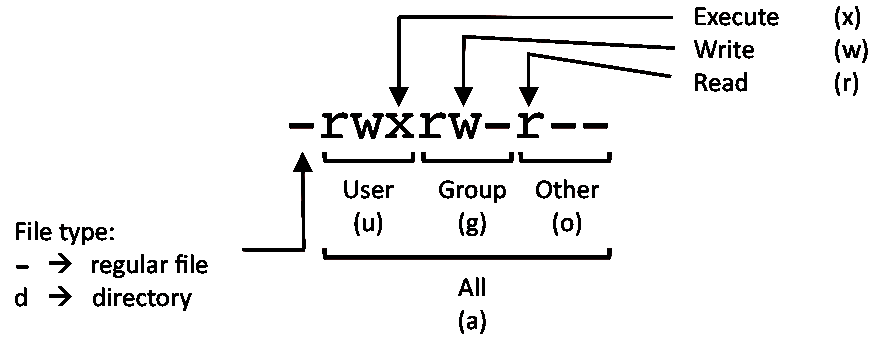

###### Display the user and group ids of your current user.
`id`

###### Display the last users who have logged onto the system.
`last`

###### Show who is logged into the system.
`who`

###### Show who is logged in and what they are doing.
`w`

###### Create a group named "test".
`groupadd test`

###### Create an account named john, with a comment of "John Smith" and create the user's home directory.
`useradd -c "John Smith" -m john`

###### Delete the john account.
`userdel john`

###### Add the john account to the sales group
`usermod -aG sales john`

###### PERMISSIONS EXAMPLE
        
         U   G   W
        rwx rwx rwx     chmod 777 filename
        rwx rwx r-x     chmod 775 filename
        rwx r-x r-x     chmod 755 filename
        rw- rw- r--     chmod 664 filename
        rw- r-- r--     chmod 644 filename

